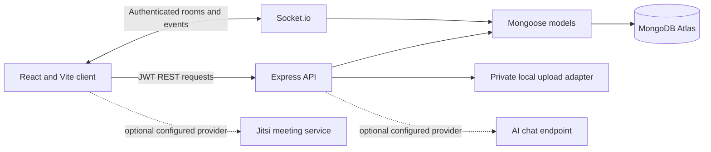

# CollabHub

CollabHub is a student collaboration and project management platform. The app has implementations for the Phase 1-14 feature set, Phase 15 security hardening and tests, and Phase 16-17 deployment/documentation preparation. Phase 18 final real-database, provider, browser, and deployment verification remains incomplete because those integrations were not configured here.

## Stack

- Client: React, Vite, Tailwind CSS, React Router, Axios, Socket.io client
- Server: Node.js, Express, Mongoose, MongoDB, JWT, bcryptjs, Socket.io

## Problem and objectives

Student project teams often split tasks, discussion, files, and deadlines across disconnected tools. CollabHub brings project membership, task tracking, collaboration, and progress reporting into one workspace. The implementation objectives are to keep collaboration tied to authorized project membership, persist work in MongoDB, provide responsive task and calendar views, and make optional integrations fail clearly when they are not configured.

## Prerequisites and database

- Node.js and npm versions supported by the installed Vite release.
- A MongoDB database (Atlas or compatible MongoDB deployment) and network access from the API host.
- Optional Jitsi JWT-enabled meeting provider and OpenAI-compatible AI endpoint.

Set `MONGO_URI` in `server/.env`; the backend connects before it begins listening and exits if the database is unavailable. Mongoose schemas create the required indexes when automatic index creation is enabled. Review index creation and database backup policies before production use.

## Feature summary

The implemented set includes registration/login and profiles, projects and teams, tasks/Kanban, task comments, private file sharing, project chat, notifications, social feed, global search, task calendar, analytics, optional AI suggestions, Jitsi meeting integration, shared whiteboards, and an admin dashboard. AI/video need provider configuration; database and browser workflows still need end-to-end verification.

## Local setup

1. Install dependencies in `server` and `client` with `npm install`.
2. Copy `server/.env.example` to `server/.env` and configure MongoDB and a long random `JWT_SECRET`.
3. Start the API from `server` using `npm run dev`.
4. Start the client from `client` using `npm run dev`.

The client defaults to `http://localhost:5000/api`; set `VITE_API_URL` when using a different API URL.

## Environment variables

| Variable | Purpose |
| --- | --- |
| `PORT` | API listening port, default 5000 |
| `MONGO_URI` | MongoDB connection string |
| `JWT_SECRET` | Secret used to sign authentication tokens |
| `JWT_EXPIRES_IN` | Token lifetime, default 7d |
| `MAX_UPLOAD_BYTES` | Maximum uploaded file size, default 10485760 (10 MiB) |
| `VITE_MAX_UPLOAD_BYTES` | Optional client-side upload limit at build time; align with `MAX_UPLOAD_BYTES` |
| `LOCAL_UPLOAD_DIR` | Optional private local upload directory; defaults to `server/private-uploads` |
| `AI_API_URL` | Optional HTTPS OpenAI-compatible chat completions URL |
| `AI_API_KEY` | Optional provider key; backend only |
| `AI_MODEL` | Optional provider model identifier |
| `JITSI_DOMAIN` | Optional Jitsi host, such as your configured meeting domain |
| `JITSI_APP_ID` | Jitsi application issuer configured by the provider |
| `JITSI_APP_SECRET` | Jitsi shared secret, backend only |
| `CORS_ORIGINS` | Comma-separated exact frontend origins; HTTPS required in production |
| `TRUST_PROXY_HOPS` | Trusted reverse proxy count, default 0 |

## Phase 5 API and access rules

Every route requires a bearer token. Only project owners and members can access task discussions or project files. Comment edits and deletes are limited to the author. Files can be deleted by the uploader or project owner.

- `GET /api/tasks/:taskId/comments`, `POST /api/tasks/:taskId/comments`
- `PUT /api/comments/:commentId`, `DELETE /api/comments/:commentId`
- `POST /api/projects/:projectId/files`, `GET /api/projects/:projectId/files`
- `GET /api/projects/:projectId/files/:fileId/download`, `DELETE /api/projects/:projectId/files/:fileId`

Uploads use an `application/octet-stream` request body and `X-File-Name` and `X-File-Content-Type` headers. The development adapter accepts PDF, DOC/DOCX, plain text, PNG, JPEG, GIF, and WebP. It validates extension/type and basic content signatures, assigns random storage keys, and stores data outside static serving. Configure durable private object storage before production deployment: local disk is development-only and is not shared across backend instances. Do not put `LOCAL_UPLOAD_DIR` under a public/static directory.

## Core API summary

| Area | Routes |
| --- | --- |
| Authentication | `POST /api/auth/register`, `POST /api/auth/login`, `GET /api/auth/me` |
| Profiles/projects/tasks | `/api/users/profile`, `/api/projects`, `/api/projects/:projectId/tasks`, `/api/tasks/:taskId` |
| Search/calendar/analytics | `GET /api/search`, `GET /api/calendar`, `GET /api/analytics` |
| Feed/notifications | `/api/posts`, `/api/notifications` |
| Health | `GET /api/health` (503 when MongoDB is disconnected) |

The phase-specific route summaries below document comments/files, chat, AI, meetings, whiteboard, and administration.

## Verification status

The client production build passed with route-level lazy loading. Backend syntax checks passed across 53 JavaScript files. Automated tests are configured and run with `npm test` in `server`. Database-backed API workflows and authenticated upload/download still need manual verification against an isolated test MongoDB instance.

## Phase 6 project chat

`GET /api/projects/:projectId/messages?limit=50&beforeId=<messageId>` returns chronological messages for a member, with older-page cursor support. Socket.io authenticates with the same JWT as REST (`socket.auth.token`). Events are `project:join` (`{ projectId }`, ack `{ success, projectId }`), `project:leave` (`{ projectId }`), `project:send-message` (`{ projectId, text }`, ack `{ success, message }`), and server broadcast `project:message` (`{ message }`). Message bodies are limited to 2000 characters and saved before the room broadcast. The chat UI re-joins after reconnect. Set `VITE_SOCKET_URL` if the socket server URL differs from the API host.

## Phase 7 notifications

Authenticated notification endpoints are `GET /api/notifications?limit=30`, `GET /api/notifications/unread-count`, `PATCH /api/notifications/:id/read`, `PATCH /api/notifications/read-all`, and `DELETE /api/notifications/:id`. Results and mutations are scoped to the authenticated recipient. The app generates notifications for project member additions/removals and task assignments, and emits `notification:new` to the recipient's authenticated socket room. Deadline reminders are not configured because this project has no scheduler.

## Phase 8 social feed

Authenticated feed routes are `GET /api/posts?page=1&limit=10`, `POST /api/posts`, `GET /api/posts/:postId`, `PUT`/`DELETE /api/posts/:postId`, `POST /api/posts/:postId/likes`, and `POST`/`PUT`/`DELETE /api/posts/:postId/comments[/:commentId]`. Authors control their posts and comments; likes use MongoDB set updates to avoid duplicates. Image attachments accept an optional HTTP(S) URL. User following is not implemented.

## Phase 9 search and calendar

`GET /api/search?q=...&type=projects|tasks|users|posts` searches using MongoDB text indexes. Private projects and their tasks are constrained to projects owned by or joined by the current user. User results expose only public name and profile image fields. `GET /api/calendar?from=<ISO date>&to=<ISO date>` returns actual due-dated tasks for accessible projects, with date ranges limited to 184 days. The calendar page navigates months and links each task to its project board; tasks without due dates are omitted.

## Phase 10 analytics

`GET /api/analytics?projectId=<id>` reports database-backed task counts, overdue tasks, status/priority/assignee distributions, recent task creation, and project completion summaries. Every selected project is checked against the authenticated user's memberships. Completion is completed tasks divided by total tasks, rounded to a percentage; an empty task scope is 0%. The dashboard uses labeled proportional bars and project progress indicators without a new chart dependency.

## Phase 11 AI assistant

`POST /api/ai/projects/:projectId/assistant` accepts an operation (`summary`, `breakdown`, `priorities`, or `status-report`) and optional prompt. It includes only the authorized project's details and up to 150 tasks. Configure `AI_API_URL`, `AI_API_KEY`, and `AI_MODEL` for an OpenAI-compatible provider; otherwise the UI reports the exact setup needed and the rest of the app remains available. Requests are limited to 5 per user per minute. Results are suggestions and are never applied automatically.

## Phase 12 video meetings

Project meeting metadata and start/end controls are protected by project membership. `POST /api/projects/:projectId/meeting/:meetingId/token` issues a room-specific Jitsi JWT with a 3-minute lifetime; the Jitsi shared secret remains on the backend. Configure `JITSI_DOMAIN`, `JITSI_APP_ID`, and `JITSI_APP_SECRET`, and configure JWT authentication with matching issuer/audience/domain on the provider. Jitsi's token requirements are documented in its [official token format](https://github.com/jitsi/lib-jitsi-meet/blob/master/doc/tokens.md). HTTPS is required in production for browser media permissions. The integration has not been verified against a configured provider; without provider setup the UI explains these requirements and keeps other project functions available. TURN relay configuration may be needed for restrictive networks.

## Phase 13 collaborative whiteboard

`GET /api/projects/:projectId/board` reads the persisted board for authorized members. Socket events are `board:join` (`{ projectId }`, ack includes saved items), `board:leave` (`{ projectId }`), `board:update` (`{ projectId, items }`, ack success/error), and server broadcast `project:board-updated` (`{ projectId, items, updatedAt, updatedBy }`). The server validates drawing types, coordinates, colors, widths, text size, element count, and payload size; each board is limited to 1000 elements and 750 KB serialized. Updates are stored before broadcast. Simultaneous full-board edits use last-write-wins behavior.

## Phase 14 administration

Admin APIs under `/api/admin` require the database role `admin` and server middleware. `GET /overview`, `GET /users?page=1&search=...`, `PATCH /users/:id/status`, `GET /posts`, and `PATCH /posts/:postId/moderation` provide counts, pagination/search, suspension, and post moderation. Administrative changes are recorded in `AdminAction`; suspended accounts cannot log in or continue API/socket use. To bootstrap the first administrator, register and verify a regular account, then run `BOOTSTRAP_ADMIN_EMAIL=the-account@example.com npm run admin:bootstrap` from `server` once. The script refuses to act if an admin already exists and does not create public admin registration. Do not commit or persist the bootstrap email variable.

## Architecture and project layout

`client/src` contains pages, reusable components, auth state, and REST/socket clients. `server/routes` maps APIs to `server/controllers`; `server/models` holds Mongoose schemas; middleware handles authentication, project access, rate limits, and admin roles. Uploaded file bytes stay outside static serving. Socket.io currently uses its in-memory adapter and is intended for one backend instance.

## Security and roles

Registration always creates a student account. JWTs use a required, non-placeholder secret of at least 32 characters. Project/task/file/comment access is verified on the server. Admin endpoints use the database role, never a client role field. Suspended accounts are rejected by REST and new socket connections; existing sockets are disconnected on suspension. Production startup requires MongoDB, a strong JWT secret, and explicit HTTPS CORS origins. The API applies request limits, login/registration rate limits, security headers, and sanitized production errors.

## Tests and actual verification

Run the backend tests with `cd server && npm test`; run the client production build with `cd client && npm run build`. The backend suite covers bearer authentication, suspended accounts, project membership, admin authorization, malformed JSON, health status, response security headers, startup configuration, whiteboard payload validation, and file signature validation. Database-backed workflows are not covered by these unit/API-boundary tests. No browser-driven frontend test runner is configured. Most recent observed results: 13 backend tests passed; client production build passed with route-level chunks and no size warning. Re-run both commands after future changes.

## Deployment preparation

Deployment has not been performed and there are no verified live URLs. Build and deploy the backend Dockerfile to a Node host that supports long-lived WebSocket connections; use a single API instance unless a Socket.io adapter and sticky sessions are configured. Provision MongoDB Atlas, set `MONGO_URI`, `JWT_SECRET`, `NODE_ENV=production`, `PORT`, and exact HTTPS `CORS_ORIGINS` in the hosting secret manager. Set `TRUST_PROXY_HOPS` only to the known trusted proxy count. Configure the health check to call `/api/health` (it returns 503 if MongoDB is disconnected).

Build the frontend image with the actual API and socket origins, for example `docker build --build-arg VITE_API_URL=https://api.example.com/api --build-arg VITE_SOCKET_URL=https://api.example.com -t collabhub-client ./client`; the example domains must be replaced with the deployed API URL. Serve both sites over HTTPS. The frontend variables are embedded at build time. The backend image deliberately excludes `.env` and uploaded files. This project currently has no cloud object-storage adapter: use a durable private mounted volume for a single development/staging instance, or add and configure private object storage before production file sharing. AI and Jitsi credentials are optional backend secrets. A real Jitsi call additionally needs a provider configured for the expected JWT issuer/audience/domain; AI needs an OpenAI-compatible endpoint. Docker images and a hosting deployment have not been tested here.

For local containers, build with `docker build -t collabhub-server ./server` and `docker build --build-arg VITE_API_URL=<api-url>/api --build-arg VITE_SOCKET_URL=<api-url> -t collabhub-client ./client`. Pass backend secrets at runtime rather than baking them into an image. Review `.gitignore`, `server/.dockerignore`, and `client/.dockerignore` before publishing.

## Phase 18 verification and submission notes

| Feature area | Status |
| --- | --- |
| Registration, login, profiles, projects, teams, tasks, Kanban | Present from the existing Phase 1-4 implementation; not end-to-end verified in this environment |
| Task comments and private project files | Implemented; client build and backend syntax checked; database workflow not exercised |
| Project chat and notifications | Implemented; syntax/build checked; live multi-user delivery not exercised against MongoDB |
| Social feed, global search, calendar, analytics | Implemented; build/syntax checked; actual database result correctness not exercised |
| AI assistant | Configurable integration; not configured or provider-tested |
| Video meetings | Jitsi JWT integration point and UI; requires provider setup and HTTPS; not call-tested |
| Whiteboard | Implemented; payload/unit validation tested; multi-client persistence not exercised |
| Admin tools | Implemented; middleware/API-boundary tests pass; bootstrap flow not run against a real database |
| Production deployment | Not deployed; Docker and environment preparation documented |

Suggested demo: register/login; create a project; add a member; create and assign a task; update it on the Kanban board; add a task comment and a small allowed file; open chat and whiteboard in two member sessions; show notifications, feed, search, calendar, analytics, optional integrations, and admin-only views if configured. Use a test MongoDB and non-sensitive sample content. No screenshots or submission have been fabricated.

GitHub checklist: configure branch protection; keep `.env`/provider credentials and private uploads out of commits; set repository description and license; add actual screenshots only after capture; configure CI to run `server npm test` and `client npm run build`; create Atlas/network and host secrets outside source; record verified URLs and test results after a real deployment. The provided workspace has no visible `.git` directory, so no commit or repository publication was performed.

## Known limitations and next improvements

- Database-backed workflows and the Phase 1-4 flows need a real isolated MongoDB end-to-end run.
- Project files currently use private local disk; add an object-storage adapter before multi-instance or production file sharing.
- Socket rooms and API rate limits use in-memory state; horizontal scaling needs a shared Socket.io adapter and distributed rate limiter.
- Deadline reminders need a reliable scheduler; user following, direct messaging, and video call tests are not included.
- Configure and test AI and Jitsi providers; meeting JWT auth is provider-specific.
- Add browser-driven tests, test file-download behavior, and exercise unauthorized project access against real persisted data.

No screenshots are included because none were captured from a running authenticated demo. Capture them after setup using non-sensitive sample accounts and data. Suggested demo narration: sign in, create a project, invite a teammate, create/assign/update a task, discuss it, share/download a file, use chat and whiteboard from a second member session, then show feed/search/calendar/analytics and any configured integrations/admin tools. The repository includes preparation notes only; no internship submission, approval, or hosting publication was performed.
